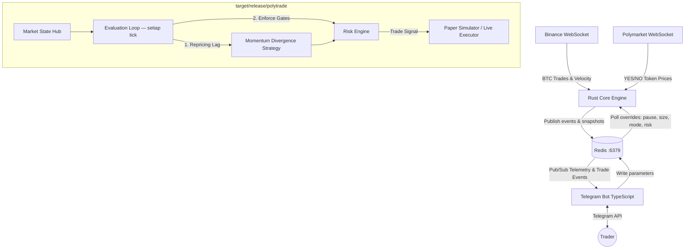

# ⚡ PolyTrade 5M Alpha Engine

> Ultra-low latency algorithmic trading bot untuk **Polymarket CLOB BTC 5M Up/Down** prediction markets.
> Dibangun di atas arsitektur dual-process yang terpisah — **Rust Core Engine** untuk evaluasi market real-time dan **TypeScript Telegram Bot** untuk kontrol jarak jauh.

---

## 📋 Daftar Isi

- [Arsitektur Sistem](#-arsitektur-sistem)
- [Fitur Utama](#-fitur-utama-strategy-v2)
- [Prerequisites](#-prerequisites)
- [Panduan Instalasi](#-panduan-instalasi)
- [Konfigurasi](#️-konfigurasi-defaulttoml)
- [Menjalankan Bot](#-menjalankan-bot)
- [Perintah Telegram](#-perintah-telegram)
- [Edge Monitor](#-edge-monitor)
- [Mode Paper vs Live](#-mode-paper-vs-live)
- [Monitoring & Logs](#-monitoring--logs)
- [Testing & Diagnostik](#-testing--diagnostik)
- [Troubleshooting](#-troubleshooting)
- [Struktur Proyek](#-struktur-proyek)

---

## 🏗 Arsitektur Sistem

PolyTrade menggunakan arsitektur dual-process yang berkomunikasi via Redis lokal:



**Kenapa arsitektur ini?**
- Rust menangani semua kalkulasi market kritis dengan latensi sub-millisecond
- Telegram bot bersifat stateless — crash bot tidak mempengaruhi engine trading
- Redis sebagai message broker ringan untuk IPC lokal

---

## ✨ Fitur Utama (MomentumDivergence Strategy)

Fokus pada satu strategi utama yang dioptimalkan dengan win rate tinggi (> 60%), probabilitas entry selektif, dan tingkat false signal rendah.

### 🎯 Momentum Divergence Strategy
Mendeteksi window di mana **BTC bergerak dengan momentum kuat tetapi harga Polymarket belum merespons (repricing lag)**. Bot mengevaluasi dan menyaring sinyal menggunakan filter gates berikut:
- **BTC Velocity Threshold**: Kecepatan pergerakan BTC harus melebihi baseline minimum (`min_velocity_abs`).
- **Uncertainty Price Zone**: Harga kontrak Polymarket berada di rentang ketidakpastian `[0.32, 0.68]`.
- **Divergence & Edge**: Divergence score antara estimasi internal dan harga market menghasilkan edge positif yang melampaui limit minimum (`min_edge_pct`).
- **Order Flow Indicator (OFI)**: Menganalisis rasio volume beli vs jual di Binance untuk memastikan order flow searah dengan pergerakan harga BTC.
- **Velocity Consistency**: Mengukur seberapa konsisten arah pergerakan harga BTC untuk menghindari entry pada noise / spike sesaat (`min_velocity_consistency`).
- **Price Acceleration Guard**: Mencegah entry jika pergerakan harga melambat/berbalik secara tajam di akhir momentum burst (decelerasi kuat).
- **Session Opportunity Tracker**: Menganalisis historical hit-rate dan memprioritaskan sesi dengan sinyal kualitas tertinggi.

### 📊 Price Velocity & Trend Analyzer
Menghitung metrik pergerakan BTC dalam 3 window untuk analisis momentum yang komprehensif:
- **Short (5s)** — untuk deteksi perubahan jangka sangat pendek
- **Long (10s)** — klasifikasi trend keseluruhan & baseline velocity
- **Medium (15s)** — pengukuran tren jangka menengah

### 🔒 Risk Engine
- Maksimal **1 posisi aktif** setiap saat (hard limit)
- Cooldown otomatis setelah N consecutive losses
- Dynamic exposure cap dalam USD
- Interval minimum antar trade

### 🤖 Stateless Telegram Bot
- Dashboard HTML premium dengan semua metrik real-time
- Notifikasi otomatis: trade masuk, exit, PnL sesi
- Edge monitor setiap 30 detik
- Semua parameter bisa dikonfigurasi langsung dari Telegram

### 🛡️ Data Reliability & Latency Audit (Sprint Fix)
- **Price Validator Gate**: Enforces a Price Jump Guard (limits price change per window), Stale Snapshot Detection (rejects slow REST snapshots if live WS is available), and Sequence Number Regression checks.
- **Entry Price Freshness Gate**: Rejects signal entries if the cached price is older than 2 seconds (exits are unaffected).
- **Polymarket Dual Channel WS**: Subscribes to both `market` and `book` channels for high-frequency pricing updates.
- **Polymarket REST Fallback**: Automatically polls the REST CLOB endpoint every 2 seconds if the WS tick rate falls below 0.2/s, recovering when it exceeds 0.5/s.
- **Corrected Binance Latency**: Computes actual network latency using the event time (`E` field) against local receive time, and monitors secondary latency via WS ping/pong every 30 seconds.
- **Paper Trade Anomaly Filtering**: Detects and flags suspicious paper trades (>50% PnL in <30s, or entry <0.05 or >0.95) as stale-price artifacts, excluding them from core statistics and reporting them separately.

---

## 📦 Prerequisites

Pastikan semua tools berikut sudah terinstall di Linux host Anda:

| Tool | Versi Minimum | Keterangan |
|---|---|---|
| **Rust** | Stable (Edition 2021) | `rustup`, `cargo`, `rustc` |
| **Node.js** | v20+ (v22 LTS dianjurkan) | Untuk Telegram bot |
| **Redis** | 6+ | Berjalan di `127.0.0.1:6379` |
| **gcc / cc** | Apapun yang support C99 | Build dependency Rust |

---

## 🚀 Panduan Instalasi

### Langkah 1 — Install Rust (jika belum ada)

```bash
curl --proto '=https' --tlsv1.2 -sSf https://sh.rustup.rs | sh
source "$HOME/.cargo/env"
rustc --version   # harus menampilkan versi
```

### Langkah 2 — Install Node.js (Standalone, tanpa sudo)

Cocok untuk VPS/server tanpa akses root:

```bash
curl -fsSL https://nodejs.org/dist/v22.15.0/node-v22.15.0-linux-x64.tar.xz -o /tmp/node.tar.xz
tar -xJf /tmp/node.tar.xz -C ~/
mv ~/node-v22.15.0-linux-x64 ~/node
rm /tmp/node.tar.xz

# Tambahkan ke PATH (tambahkan juga ke ~/.bashrc agar permanen)
export PATH="$HOME/node/bin:$PATH"
echo 'export PATH="$HOME/node/bin:$PATH"' >> ~/.bashrc

node --version    # harus menampilkan v22.15.0
npm --version
```

### Langkah 3 — Install Redis (Standalone, tanpa sudo)

Jika Redis belum terinstall di sistem, gunakan binary lokal yang sudah disertakan:

```bash
# Redis binary sudah disiapkan di ~/redis-bin oleh script setup
# Verifikasi ketersediaan:
ls ~/redis-bin/usr/bin/redis-server

# Test manual:
~/redis-bin/usr/bin/redis-server --port 6379 --daemonize yes
~/redis-bin/usr/bin/redis-cli ping   # harus menjawab PONG
```

### Langkah 4 — Clone & Setup Proyek

```bash
git clone <repo-url> polymarket5m
cd polymarket5m/polytrade
```

### Langkah 5 — Build Rust Core Engine

```bash
export PATH="$HOME/.cargo/bin:$PATH"
cargo build --release
# Binary akan tersedia di: target/release/polytrade
```

> **Catatan:** Build pertama akan memerlukan beberapa menit karena mengunduh dependencies.

### Langkah 6 — Konfigurasi Telegram Bot

```bash
cd bot
cp .env.example .env
```

Edit file `.env` dengan text editor favorit Anda:

```bash
nano .env
```

Isi kolom berikut:

```env
# Token dari @BotFather di Telegram
TELEGRAM_BOT_TOKEN=123456789:AABBCCxxx...

# ID Telegram user yang boleh mengakses bot (pisahkan koma untuk beberapa user)
ALLOWED_USER_IDS=987654321

# Redis URL (biarkan default jika Redis berjalan lokal)
REDIS_URL=redis://127.0.0.1:6379
```

> **Cara mendapatkan Telegram User ID:** Kirim pesan ke [@userinfobot](https://t.me/userinfobot) — bot akan membalas dengan ID Anda.

### Langkah 7 — Build Telegram Bot

```bash
cd bot     # jika belum di folder bot
npm install
npm run build
```

---

## ▶️ Menjalankan Bot

### Cara Cepat (Recommended) — Script Otomatis

```bash
cd polytrade
chmod +x start_all.sh
./start_all.sh
```

Script ini secara otomatis akan:
1. ✅ Mengecek dan menjalankan Redis jika belum aktif
2. ✅ Mematikan proses polytrade yang mungkin masih berjalan
3. ✅ Menjalankan Rust Core Engine di background (`engine.log`)
4. ✅ Menjalankan Telegram Bot di background (`bot.log`)

### Cara Manual (per komponen)

**Terminal 1 — Redis:**
```bash
~/redis-bin/usr/bin/redis-server --port 6379 --dir ./data --daemonize yes
```

**Terminal 2 — Rust Engine:**
```bash
export PATH="$HOME/.cargo/bin:$PATH"
./target/release/polytrade
```

**Terminal 3 — Telegram Bot:**
```bash
export PATH="$HOME/node/bin:$PATH"
cd bot && node dist/index.js
```

### Menghentikan Semua Layanan

```bash
pkill -f "target/release/polytrade"
pkill -f "dist/index.js"
~/redis-bin/usr/bin/redis-cli shutdown
```

---

## ⚙️ Konfigurasi (`config/default.toml`)

Semua parameter strategi dapat diubah langsung di file `config/default.toml`. Bot perlu di-restart agar perubahan berlaku.

```toml
# ─── FEEDS ─────────────────────────────────────────────
[feeds]
binance_ws = "wss://stream.binance.com:443/ws/btcusdt@trade"
polymarket_rest = "https://gamma-api.polymarket.com"
polymarket_ws = "wss://ws-subscriptions-clob.polymarket.com/ws/market"
market_keyword_filter = "BTC"

# ─── GENERAL STRATEGY CONTROLS ─────────────────────────
[strategy]
observation_mode = false             # true = hanya log edge tanpa trading
relaxed_mode_after_mins = 8          # thresholds dilonggarkan setelah 8 menit
floor_mode_after_mins = 18           # floor thresholds aktif setelah 18 menit
session_definition_mins = 30         # definisi panjang sesi opportunity

# ─── STRATEGI MOMENTUM DIVERGENCE ──────────────────────
[strategy.divergence]
enabled = true
market_uncertainty_min = 0.32        # zona entry minimum YES price
market_uncertainty_max = 0.68        # zona entry maximum YES price
min_velocity_abs = 0.10              # BTC velocity min $/s dalam 10s
min_velocity_consistency = 0.55      # konsistensi arah pergerakan velocity (min 55%)
min_edge_pct = 0.035                 # minimum edge (3.5%)
min_confidence = 0.42                # minimum confidence (42%)
profit_target_pct = 0.10             # take profit +10%
stop_loss_pct = 0.06                 # stop loss -6%
exit_before_final_secs = 35          # exit N detik sebelum market settlement
min_time_remaining_secs = 50         # tidak entry jika sisa waktu < 50s
max_time_remaining_secs = 280        # tidak entry jika sisa waktu > 280s
require_volume_alignment = true      # volume delta signum harus searah velocity

# ─── RISK ENGINE ────────────────────────────────────────
[risk]
max_concurrent_positions = 1         # STRICT: maks 1 posisi aktif
max_exposure_usd = 10.0              # total exposure maksimum $10
consecutive_loss_limit = 3           # cooldown setelah 3 loss berturut-turut
cooldown_after_loss_secs = 120       # cooldown 120 detik
min_trade_interval_secs = 15         # jeda minimum antar trade

# ─── DATA QUALITY & HEARTBEAT ───────────────────────────
[data_quality]
max_price_jump_pct_per_5s = 0.12      # max 12% price change per 5 seconds
max_price_age_ms = 2000               # reject signals if price older than 2s (live WS)
max_price_age_fallback_ms = 8000      # REST fallback at 2s interval
ws_min_tick_rate = 0.2                # ticks/s below this triggers fallback
ws_silence_reconnect_secs = 15        # force reconnect if no message for 15s
ws_ping_interval_secs = 20            # send WS ping every 20s for latency

# ─── PAPER MODE ─────────────────────────────────────────
[paper]
enabled = true                         # true = paper mode (simulasi), false = live
default_size_usd = 1.0                 # ukuran trade default $1
flag_suspicious_trades = true          # flag & exclude suspicious trades
suspicious_pnl_threshold_pct = 50.0   # pnl pct above this is suspicious
suspicious_hold_max_secs = 30          # hold duration below this is suspicious
```

---

## 🎮 Perintah Telegram

Kirim `/start` untuk memunculkan menu navigasi utama.

### 📊 Observabilitas

| Perintah | Deskripsi |
|---|---|
| `/status` | Dashboard HTML lengkap: market aktif, harga YES/NO, BTC velocity & trend, posisi terbuka, latency feed (avg + ping), clock offset, tick rates, fallback status, price freshness, validator rejections, dan **Missing Checklist**. |
| `/pnl` | Ringkasan performa sesi: total profit, win rate, trade terbaik/terburuk, breakdown arah YES vs NO, dan daftar **Suspicious Trades** (stale price artifacts) yang diexclude dari PnL. |

### ⚙️ Kontrol Operasional

| Perintah | Deskripsi |
|---|---|
| `/mode paper` | Aktifkan mode simulasi (paper trading) |
| `/mode live` | Aktifkan live trading — memerlukan konfirmasi 30 detik |
| `/pause` | Hentikan semua aktivitas trading sementara |
| `/resume` | Lanjutkan trading setelah pause |
| `/setsize <amount>` | Atur ukuran trade dalam USD (min: `$0.10`, maks: `$100.00`) |

### 🛡 Manajemen Risiko

| Perintah | Deskripsi |
|---|---|
| `/risk` | Tampilkan semua parameter risiko saat ini |
| `/risk minedge <nilai>` | Ubah minimum edge %, contoh: `/risk minedge 10` |
| `/risk minconf <nilai>` | Ubah minimum confidence, contoh: `/risk minconf 0.50` |
| `/risk stoploss <nilai>` | Ubah stop loss %, contoh: `/risk stoploss 5` |
| `/risk profit <nilai>` | Ubah profit target %, contoh: `/risk profit 12` |
| `/risk maxloss <n>` | Ubah consecutive loss limit |
| `/risk cooldown <secs>` | Ubah durasi cooldown (detik) |

---

## 📡 Edge Monitor

Bot secara otomatis mengirim notifikasi **setiap 30 detik** dengan kondisi market terkini:

```
━━━━━━━━━━━━━━━━━━━━━━━━━━
📡 EDGE MONITOR
━━━━━━━━━━━━━━━━━━━━━━━━━━

🎯 BTC 5M Up/Down
⏱  02:47 remaining

📈 Market Price
  YES  ░░░░░████░░░  57%
  NO   ███░░░░░░░░░  43%

🧠 Internal Estimate
  YES  ░░█████████░  68%
  NO   ████░░░░░░░░  32%

⚡ Edge
  Direction   YES  ▲
  Edge        +11.0%
  Confidence  73%

🚦 Status
  ● TRADEABLE
━━━━━━━━━━━━━━━━━━━━━━━━━━
```

| Indikator Status | Arti |
|---|---|
| `● TRADEABLE` | Semua kondisi terpenuhi, bot siap trade |
| `⏸ PAUSED` | Trading di-pause manual |
| `🔒 COOLDOWN` | Dalam masa cooldown setelah consecutive loss |
| `⏰ TIME` | Sisa waktu market di luar window yang diizinkan |
| `📉 EDGE LOW` | Edge di bawah threshold minimum |
| `🎯 PRICE ZONE` | Harga di luar zona ketidakpastian |

---

## 🔄 Mode Paper vs Live

### Paper Mode (Default)
- Semua sinyal dievaluasi dan "dieksekusi" secara simulasi
- PnL dihitung dan dilaporkan secara real-time
- **Tidak ada uang nyata yang digunakan**
- Cocok untuk validasi strategi sebelum live

### Live Mode
- Bot akan mengeksekusi order nyata ke Polymarket CLOB
- Aktifkan dengan `/mode live` dan konfirmasi dalam 30 detik
- Pastikan sudah ada balance di wallet Polymarket

> ⚠️ **Penting:** Selalu uji strategi di paper mode dulu sebelum live. Pastikan Anda memahami parameter risiko sepenuhnya.

---

## 📋 Monitoring & Logs

### Real-time Log Monitoring

```bash
# Monitor Rust Core Engine
tail -f engine.log

# Monitor Telegram Bot
tail -f bot.log

# Monitor keduanya bersamaan
tail -f engine.log bot.log
```

### Filter Log Berdasarkan Level

```bash
# Hanya tampilkan error
grep "ERROR" engine.log

# Tampilkan semua trade events
grep -i "trade\|position\|entry\|exit" engine.log

# Tampilkan edge calculations
grep -i "edge\|divergence" engine.log

# Tampilkan koneksi WebSocket
grep -i "websocket\|connected\|reconnect" engine.log
```

### Cek Status Layanan

```bash
# Apakah Rust engine berjalan?
ps aux | grep "target/release/polytrade" | grep -v grep

# Apakah Telegram bot berjalan?
ps aux | grep "dist/index.js" | grep -v grep

# Apakah Redis aktif?
~/redis-bin/usr/bin/redis-cli ping   # jawaban: PONG

# Lihat semua key di Redis (debug)
~/redis-bin/usr/bin/redis-cli keys "*"
```

---

## 🧪 Testing & Diagnostik

### Compile Check & Unit Tests (Rust)

```bash
# Hanya cek kompilasi tanpa build
cargo check

# Jalankan semua unit tests
cargo test

# Lihat output test secara verbose
cargo test -- --nocapture
```

### Test Telegram Bot Commands

```bash
cd bot
npx tsx src/test_commands.ts
```

### Test Koneksi Redis

```bash
~/redis-bin/usr/bin/redis-cli ping
~/redis-bin/usr/bin/redis-cli info server
```

### Verify Build dari Scratch

```bash
# Bersihkan hasil build lama
cargo clean

# Build ulang
export PATH="$HOME/.cargo/bin:$PATH"
cargo build --release
```

---

## 🔧 Troubleshooting

### ❌ Bot tidak menerima update dari engine

1. Pastikan Redis berjalan: `redis-cli ping`
2. Pastikan engine mempublish ke Redis: `grep "publish" engine.log`
3. Restart kedua layanan dengan `./start_all.sh`

### ❌ Engine tidak terhubung ke Binance/Polymarket

```bash
# Cek koneksi ke Binance
grep "binance\|BTCUSDT" engine.log | tail -20

# Cek koneksi ke Polymarket
grep "polymarket\|clob" engine.log | tail -20
```

Kemungkinan penyebab:
- Koneksi internet tidak stabil
- WebSocket di-rate-limit (tunggu beberapa menit, engine akan reconnect otomatis)

### ❌ Latency tinggi (> 500ms)

Engine akan log warning jika latency tinggi. Ini biasanya terjadi karena:
- Koneksi internet ke Binance/Polymarket lambat
- Server VPS overload

### ❌ Edge selalu 0% / tidak pernah trade

Cek `/status` di Telegram — bagian **Missing Checklist** akan menunjukkan kondisi mana yang belum terpenuhi. Kemungkinan:
- BTC velocity terlalu rendah (`min_velocity_abs`)
- Market price di luar uncertainty zone
- Masih dalam cooldown period
- Sisa waktu market di luar window (`min/max_time_remaining_secs`)

### ❌ `cargo build` gagal: `linker cc not found`

```bash
# Setup cc-wrapper yang sudah disertakan
export PATH="$HOME/.cargo/bin:$HOME/gcc-extract/extracted/usr/bin:$PATH"
export CC="$HOME/.cargo/bin/cc-wrapper"
cargo build --release
```

### ❌ Telegram bot tidak respond

1. Pastikan `TELEGRAM_BOT_TOKEN` di `.env` sudah benar
2. Pastikan User ID Anda ada di `ALLOWED_USER_IDS`
3. Cek `bot.log` untuk error message

---

## 📁 Struktur Proyek

```
polytrade/
├── src/                        # Rust Core Engine
│   ├── main.rs                 # Entry point, inisialisasi semua subsystem
│   ├── config.rs               # Konfigurasi loader
│   ├── error.rs                # Error types
│   ├── market_data/            # Feed Binance & Polymarket WebSocket
│   │   ├── price_validator.rs  # Price Validator (Price Jump, Stale Snapshot, Seq Regression)
│   ├── strategy/               # Implementasi strategi trading
│   │   ├── divergence.rs       # MomentumDivergenceStrategy
│   │   ├── engine.rs           # Orchestrator strategi & evaluation loop
│   │   ├── filters.rs          # Gate filters (OFI, Consistency, Acceleration)
│   │   ├── session.rs          # Session opportunity tracker
│   │   └── traits.rs           # Strategy trait definitions
│   ├── probability/            # Model estimasi probabilitas & edge
│   │   ├── estimator.rs        # Kalkulasi internal probability & confidence
│   │   └── edge.rs             # Edge scoring & tradeable check
│   ├── paper/                  # Paper trading simulator
│   │   └── simulator.rs        # Simulasi posisi, P&L, exit evaluation
│   ├── risk/                   # Risk engine & gates
│   ├── events/                 # Redis pub/sub event publishing
│   └── storage/                # State storage via Redis
│
├── bot/                        # TypeScript Telegram Bot
│   ├── src/
│   │   ├── index.ts            # Entry point bot
│   │   ├── commands/           # Handler setiap command Telegram
│   │   │   ├── status.ts       # /status — dashboard utama
│   │   │   ├── pnl.ts          # /pnl — performa sesi
│   │   │   ├── mode.ts         # /mode — toggle paper/live
│   │   │   ├── risk.ts         # /risk — manajemen risiko
│   │   │   ├── size.ts         # /setsize — ukuran trade
│   │   │   ├── pause.ts        # /pause
│   │   │   └── resume.ts       # /resume
│   │   ├── notifications/      # Notifikasi otomatis
│   │   │   └── edge_monitor.ts # Edge broadcast setiap 30 detik
│   │   ├── redis/              # Redis client & helpers
│   │   └── ui/                 # Template HTML untuk Telegram
│   ├── .env.example            # Template environment variables
│   ├── package.json
│   └── tsconfig.json
│
├── config/
│   └── default.toml            # Semua parameter strategi & risiko
│
├── data/                       # Redis dump & data persisten
├── start_all.sh                # Script untuk menjalankan semua layanan
├── engine.log                  # Log output Rust engine (auto-generated)
├── bot.log                     # Log output Telegram bot (auto-generated)
├── Cargo.toml                  # Rust dependencies
└── README.md                   # Dokumentasi ini
```

---

## 📊 Parameter Reference

### Risk Parameters (via `/risk`)

| Parameter | Default | Range | Deskripsi |
|---|---|---|---|
| `minedge` | 8% | 1–50 | Minimum edge untuk entry |
| `minconf` | 0.45 | 0.1–0.99 | Minimum confidence |
| `stoploss` | 6% | 1–50 | Stop loss percentage |
| `profit` | 10% | 1–100 | Profit target percentage |
| `maxloss` | 3 | 1–20 | Consecutive loss sebelum cooldown |
| `cooldown` | 120s | 10–3600 | Durasi cooldown dalam detik |

### Velocity Windows

| Window | Durasi | Kegunaan |
|---|---|---|
| Short | 5 detik | Perhitungan momentum jangka sangat pendek |
| Long | 10 detik | Klasifikasi trend keseluruhan & baseline velocity |
| Medium | 15 detik | Pengukuran tren jangka menengah |

---

## ⚖️ Disclaimer

Software ini dibuat untuk tujuan edukasi dan penelitian. Trading prediction market mengandung risiko tinggi. Penulis tidak bertanggung jawab atas kerugian finansial yang ditimbulkan. Selalu gunakan uang yang Anda siap untuk kehilangan, dan pahami strategi sepenuhnya sebelum beralih ke live mode.

---

*PolyTrade 5M Alpha Engine — Built with Rust + TypeScript*
